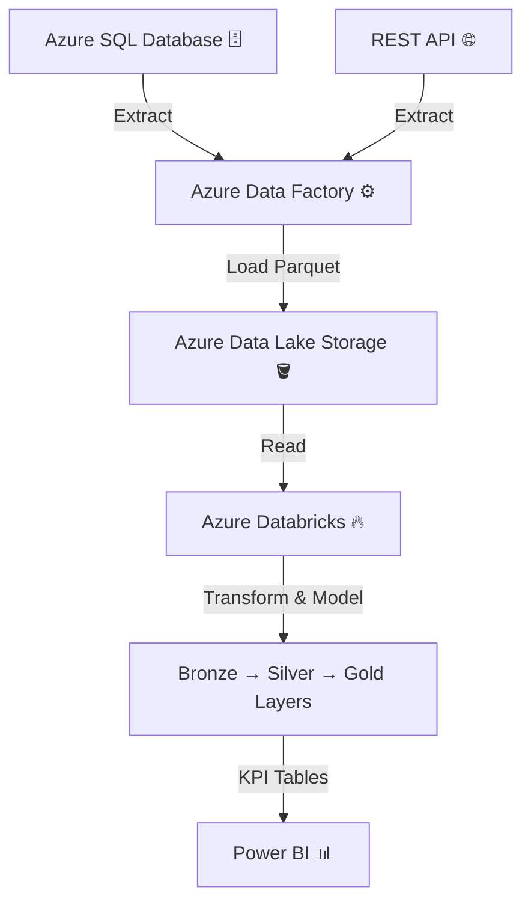
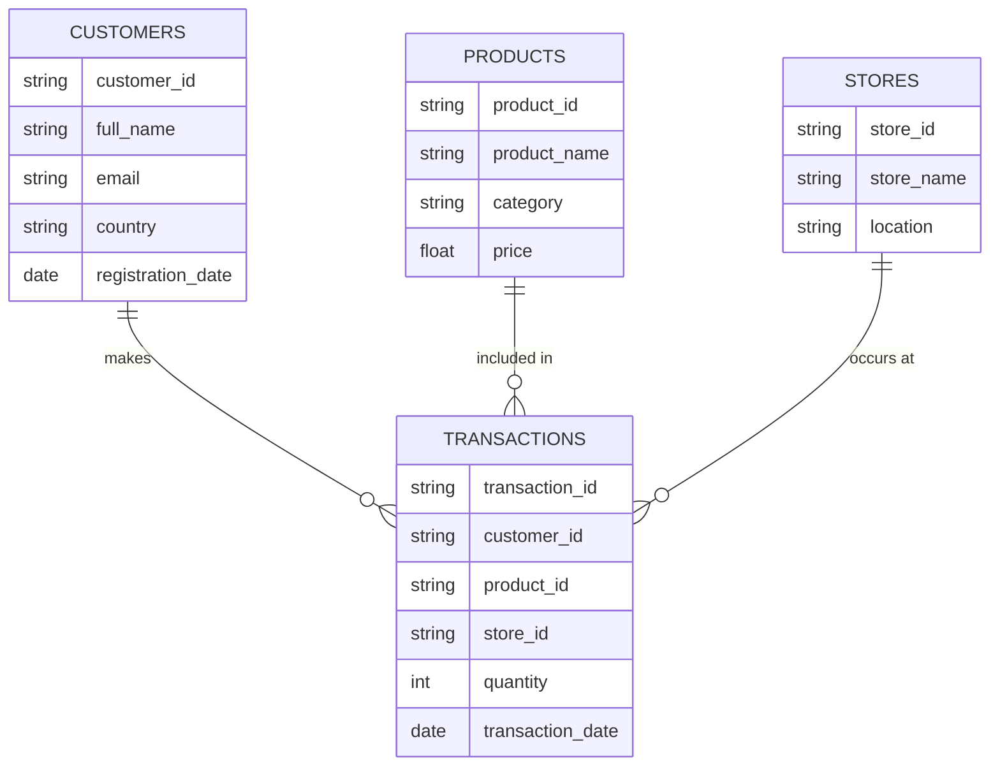

# 🛍️ Retail Data Pipeline Project  

> **End-to-End Data Engineering Project** built using **Azure Data Factory**, **Azure Data Lake**, **Azure Databricks (Spark)**, and **Power BI** following the **Medallion Architecture (Bronze–Silver–Gold)**.

---

## 🚀 Project Overview  

This project demonstrates a **Retail Data Pipeline** that automates data ingestion, transformation, and visualization.  
The architecture leverages **Azure Data Factory**, **Azure Data Lake Storage**, **Databricks**, and **Power BI** to create a **scalable, efficient, and modern data lakehouse solution**.

---

## 🧱 Architecture Diagram  

## 🗂️ Data Sources
1. Azure SQL Database

Contains 3 core tables:

🛒 products

💳 transactions

🏬 stores

2. REST API

Contains 1 table:

👤 customers

---
 ## 🏗️ Stage 1: **Azure Data Factory** for Data Ingestion     

 
-Build **Pipeline**  that

🔹 Extract data from:  
- Azure SQL Database (3 tables)  
- REST API (1 table)
 
🔹 Store all files in **Azure Data Lake Storage** as Parquet Files.  

### DATA FACTORY PIPELINE

### DATA lAKE STORAGE ACCOUNT

---

## ⚙️ Stage 2: Data Processing with Azure Databricks  

### 🧮 Environment Setup  
- Create **Catalog(Database)** , and **Schema** in Databricks.  
- Connect to **Azure Data Lake Storage** .  
- Use **Apache Spark** for distributed data processing.  

### 🥇 Medallion Architecture  

| Layer | Description | Example Naming |
|-------|--------------|----------------|
| 🥉 Bronze | Raw ingested data | `table_name_bronze` |
| 🥈 Silver | Cleaned and transformed data | `table_name_silver` |
| 🥇 Gold | Business-ready KPI tables | `table_name_gold` |

### 💡 KPI Tables  
- 🗺️ top_countries  
- 🏆 top_products  
- 🏬 top_stores  
- 👥 top_customers  
- 🌍 geography  
- 📆 top_year  
- 📅 top_months  

---

## 📊 Stage 3: Visualization with Power BI  

Connect **Power BI** to **Databricks SQL Endpoint** using an **Access Token**.  
Create an interactive report with **three main pages**:

| Page | Focus | Highlights |
|------|--------|-------------|
| 💰 Sales | Total revenue, monthly trends, regional breakdowns | Line & map charts |
| 📦 Products | Top-selling items, category performance | Bar charts |
| 👤 Customers | Top customers, customer locations, demographics | Pie & map visuals |

### Sales 

---

### Products

---

### Customers

---

## 🧰 Tech Stack  

| Category | Tools |
|-----------|-------|
| 💾 Storage | Azure Data Lake Storage (ADLS) |
| 🔄 Ingestion | Azure Data Factory |
| 🧮 Processing | Azure Databricks (Spark, PySpark) |
| 📈 Visualization | Power BI |
| 🏗️ Architecture | Medallion (Bronze–Silver–Gold) |

---

## 🧠 Key Learnings  

- Implemented **end-to-end data pipeline** in Azure ecosystem.  
- Applied **ETL/ELT design** using **Data Factory + Databricks**.  
- Followed **Medallion Architecture** for scalable lakehouse design.  
- Integrated **Power BI** for dashboarding.

  
